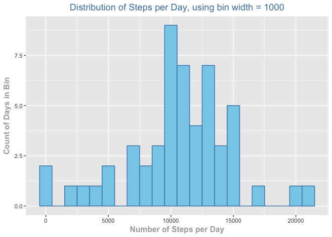
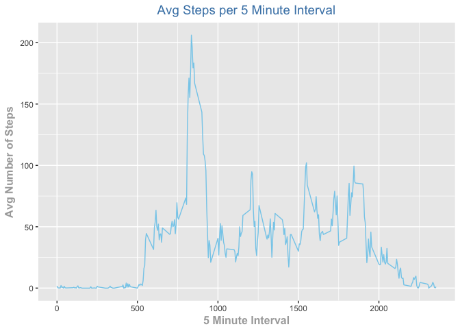
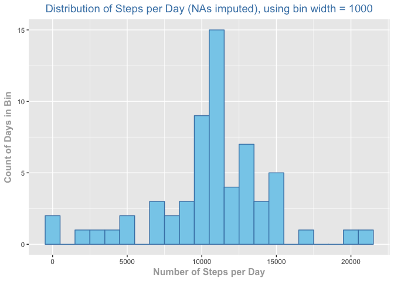
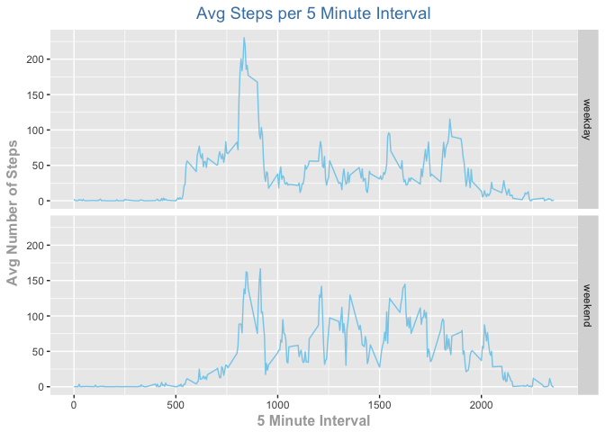

## Loading and preprocessing the data

First, I load the data from the CSV into R using read.csv and take a quick look at the data's structure.


```r
activity_data <- read.csv('activity.csv')
head(activity_data)
```

```
##   steps       date interval
## 1    NA 2012-10-01        0
## 2    NA 2012-10-01        5
## 3    NA 2012-10-01       10
## 4    NA 2012-10-01       15
## 5    NA 2012-10-01       20
## 6    NA 2012-10-01       25
```

```r
nrow(activity_data)
```

```
## [1] 17568
```

Next, I make sure that the variables are in their correct forms (i.e. that the date is coded as a date).


```r
str(activity_data)
```

```
## 'data.frame':	17568 obs. of  3 variables:
##  $ steps   : int  NA NA NA NA NA NA NA NA NA NA ...
##  $ date    : Factor w/ 61 levels "2012-10-01","2012-10-02",..: 1 1 1 1 1 1 1 1 1 1 ...
##  $ interval: int  0 5 10 15 20 25 30 35 40 45 ...
```

The date seems to be coded as a factor, so I then convert it to a date and run str() again.


```r
activity_data$date <- as.Date(activity_data$date)
str(activity_data)
```

```
## 'data.frame':	17568 obs. of  3 variables:
##  $ steps   : int  NA NA NA NA NA NA NA NA NA NA ...
##  $ date    : Date, format: "2012-10-01" "2012-10-01" ...
##  $ interval: int  0 5 10 15 20 25 30 35 40 45 ...
```

Looks good now.  I then summarize the data using summary to get a quick feel for what it looks like (i.e. how many missing values).


```r
summary(activity_data)
```

```
##      steps             date               interval     
##  Min.   :  0.00   Min.   :2012-10-01   Min.   :   0.0  
##  1st Qu.:  0.00   1st Qu.:2012-10-16   1st Qu.: 588.8  
##  Median :  0.00   Median :2012-10-31   Median :1177.5  
##  Mean   : 37.38   Mean   :2012-10-31   Mean   :1177.5  
##  3rd Qu.: 12.00   3rd Qu.:2012-11-15   3rd Qu.:1766.2  
##  Max.   :806.00   Max.   :2012-11-30   Max.   :2355.0  
##  NA's   :2304
```

About 13% of the 'steps' values are missing, so I will keep this in mind for later in the analysis when I impute the missing values.

## What is mean total number of steps taken per day?

First, since we were instructed to ingore the missing values, I will create a new dataframe in which I remove them.


```r
activity_data_clean <- na.omit(activity_data)
summary(activity_data_clean)
```

```
##      steps             date               interval     
##  Min.   :  0.00   Min.   :2012-10-02   Min.   :   0.0  
##  1st Qu.:  0.00   1st Qu.:2012-10-16   1st Qu.: 588.8  
##  Median :  0.00   Median :2012-10-29   Median :1177.5  
##  Mean   : 37.38   Mean   :2012-10-30   Mean   :1177.5  
##  3rd Qu.: 12.00   3rd Qu.:2012-11-16   3rd Qu.:1766.2  
##  Max.   :806.00   Max.   :2012-11-29   Max.   :2355.0
```

Now that the missing values are removed, I will aggregate the steps column by the date column to get the total steps per day.  I then rename the column headers and check that the data seems correct.


```r
activity_data_clean_agg <- aggregate(activity_data_clean$steps, by = list(activity_data_clean$date), FUN=sum)
names(activity_data_clean_agg) <- c('date','total_steps')
head(activity_data_clean_agg)
```

```
##         date total_steps
## 1 2012-10-02         126
## 2 2012-10-03       11352
## 3 2012-10-04       12116
## 4 2012-10-05       13294
## 5 2012-10-06       15420
## 6 2012-10-07       11015
```

I then load ggplot2 and create a histogram of the number of steps taken per day, using a bin width of 1000 steps.


```r
library(ggplot2)

ggplot(activity_data_clean_agg, aes(x = total_steps)) +
  geom_histogram(aes(y=..count..), binwidth = 1000, center = 0,
                 colour = 'steelblue', fill = 'skyblue') +
  scale_x_continuous(name = "Number of Steps per Day")+
  scale_y_continuous(name = "Count of Days in Bin")+
  ggtitle("Distribution of Steps per Day, using bin width = 1000") +
  theme(axis.title.x = element_text(face="bold", colour="darkgrey", size=12),
        axis.title.y = element_text(face="bold", colour="darkgrey", size=12),
        plot.title   = element_text(size = 14,colour="steelblue", hjust = 0.5))
```

<!-- -->

From the graph, it seems like the mean and median are both probably around 11,000 steps. I can calculate both using summary.


```r
summary(activity_data_clean_agg$total_steps)
```

```
##    Min. 1st Qu.  Median    Mean 3rd Qu.    Max. 
##      41    8841   10765   10766   13294   21194
```

From the summary above, we can see that the mean number of steps per day is 10766 and the median is 10765.

## What is the average daily activity pattern?

Again, as instructed, I will use the dataset with the NAs removed.  This time, I will aggregate the number of steps column by the interval column to get the average number of steps taken across all days during each 5 minute interval.


```r
activity_data_clean_avg <- aggregate(activity_data_clean$steps, by = list(activity_data_clean$interval), FUN=mean)
names(activity_data_clean_avg) <- c('interval','avg_steps')
head(activity_data_clean_avg)
```

```
##   interval avg_steps
## 1        0 1.7169811
## 2        5 0.3396226
## 3       10 0.1320755
## 4       15 0.1509434
## 5       20 0.0754717
## 6       25 2.0943396
```

I then create a time series graph to view avg steps per interval over the course of the day.


```r
ggplot(activity_data_clean_avg) +
  geom_line(aes(x = interval, y= avg_steps), colour = 'skyblue') +
  scale_x_continuous(name = "5 Minute Interval")+
  scale_y_continuous(name = "Avg Number of Steps")+
  ggtitle("Avg Steps per 5 Minute Interval") +
  theme(axis.title.x = element_text(face="bold", colour="darkgrey", size=12),
        axis.title.y = element_text(face="bold", colour="darkgrey", size=12),
        plot.title   = element_text(size = 14,colour="steelblue", hjust = 0.5))
```

<!-- -->

From the graph, we can see that the average max occurs somewhere between 750 and 1000 minutes.  Let's calculate exactly what the interval is that contains the largest amount of steps on average.


```r
max_value <- max(activity_data_clean_avg$avg_steps)
print(max_value) #The avg maximum amount of steps
```

```
## [1] 206.1698
```

```r
interval <- activity_data_clean_avg[activity_data_clean_avg$avg_steps == max_value,]$interval 
print(interval) #The corresponding interval
```

```
## [1] 835
```

The interval with the max average is 835.

## Imputing missing values


To review, above I calculated the total number of missing values in the original dataset like so:


```r
summary(activity_data)
```

```
##      steps             date               interval     
##  Min.   :  0.00   Min.   :2012-10-01   Min.   :   0.0  
##  1st Qu.:  0.00   1st Qu.:2012-10-16   1st Qu.: 588.8  
##  Median :  0.00   Median :2012-10-31   Median :1177.5  
##  Mean   : 37.38   Mean   :2012-10-31   Mean   :1177.5  
##  3rd Qu.: 12.00   3rd Qu.:2012-11-15   3rd Qu.:1766.2  
##  Max.   :806.00   Max.   :2012-11-30   Max.   :2355.0  
##  NA's   :2304
```

I concluded that 2304 or 13% of the 'steps' values were missing.  In order to impute the missing values, I will be using the mean of each 5 minute interval that I calculated above.

I will first merge the average steps per 5 minute interval onto the original dataframe at each corresponding interval.


```r
activity_data_merged <- merge(activity_data, activity_data_clean_avg, by = "interval", all.x = TRUE)
head(activity_data_merged)
```

```
##   interval steps       date avg_steps
## 1        0    NA 2012-10-01  1.716981
## 2        0     0 2012-11-23  1.716981
## 3        0     0 2012-10-28  1.716981
## 4        0     0 2012-11-06  1.716981
## 5        0     0 2012-11-24  1.716981
## 6        0     0 2012-11-15  1.716981
```

Then, for each value that is missing, I will set it equal to the corresponding avg_steps column value using dplyr and the coalesce() function.  In order to do this, I also need to convert the steps variable into a double instead of an integer.


```r
library(dplyr)

activity_data_filled <- activity_data_merged %>%
  mutate(steps = coalesce(as.double(steps), avg_steps))

head(activity_data_filled)
```

```
##   interval    steps       date avg_steps
## 1        0 1.716981 2012-10-01  1.716981
## 2        0 0.000000 2012-11-23  1.716981
## 3        0 0.000000 2012-10-28  1.716981
## 4        0 0.000000 2012-11-06  1.716981
## 5        0 0.000000 2012-11-24  1.716981
## 6        0 0.000000 2012-11-15  1.716981
```

We can see that the missing values are now filled in, so I will remove the avg_steps column.


```r
activity_data_filled <- activity_data_filled[,-4]
head(activity_data_filled)
```

```
##   interval    steps       date
## 1        0 1.716981 2012-10-01
## 2        0 0.000000 2012-11-23
## 3        0 0.000000 2012-10-28
## 4        0 0.000000 2012-11-06
## 5        0 0.000000 2012-11-24
## 6        0 0.000000 2012-11-15
```

I now re-aggregate the data by day and re-graph the histogram.


```r
activity_data_clean_agg_2 <- aggregate(activity_data_filled$steps, by = list(activity_data_filled$date), FUN=sum)
names(activity_data_clean_agg_2) <- c('date','total_steps')
head(activity_data_clean_agg_2)
```

```
##         date total_steps
## 1 2012-10-01    10766.19
## 2 2012-10-02      126.00
## 3 2012-10-03    11352.00
## 4 2012-10-04    12116.00
## 5 2012-10-05    13294.00
## 6 2012-10-06    15420.00
```

```r
ggplot(activity_data_clean_agg_2, aes(x = total_steps)) +
  geom_histogram(aes(y=..count..), binwidth = 1000, center = 0,
                 colour = 'steelblue', fill = 'skyblue') +
  scale_x_continuous(name = "Number of Steps per Day")+
  scale_y_continuous(name = "Count of Days in Bin")+
  ggtitle("Distribution of Steps per Day (NAs imputed), using bin width = 1000") +
  theme(axis.title.x = element_text(face="bold", colour="darkgrey", size=12),
        axis.title.y = element_text(face="bold", colour="darkgrey", size=12),
        plot.title   = element_text(size = 14,colour="steelblue", hjust = 0.5))
```

<!-- -->

It seems like since most of the missing data were for entire days, when the NAs were filled in for individual hours and then summed by day, the missing days ended up summing to approximately the previously calculated daily mean.  We can see that the axis of the histogram has grown to account for these added values around the mean, but that the tails seem unaffected.  I calculate the new mean and median below to compare:


```r
summary(activity_data_clean_agg_2$total_steps)
```

```
##    Min. 1st Qu.  Median    Mean 3rd Qu.    Max. 
##      41    9819   10766   10766   12811   21194
```

From the summary above, we can see that the mean number of steps per day is 10766 and the median is 10766.  While the mean and median have not changed much (if at all), the first and third quartile have, showing that the data is now more "middle-heavy" with the missing values imputed using my method.


## Are there differences in activity patterns between weekdays and weekends?

Using the dataset with the filled-in missing values, I will add a new column using dplyr and the weekdays() function that indicates whether each day is a weekend or a weekday.


```r
activity_data_filled <- activity_data_filled %>%
  mutate(day_type = ifelse(weekdays(date, abbreviate = FALSE) %in% c('Saturday','Sunday'),'weekend','weekday'))

head(activity_data_filled)
```

```
##   interval    steps       date day_type
## 1        0 1.716981 2012-10-01  weekday
## 2        0 0.000000 2012-11-23  weekday
## 3        0 0.000000 2012-10-28  weekend
## 4        0 0.000000 2012-11-06  weekday
## 5        0 0.000000 2012-11-24  weekend
## 6        0 0.000000 2012-11-15  weekday
```


I will now compute a new dataframe that is the average of the steps at each time interval.  I will also replicate the line graph from above showing the avg number of steps taken in each interval, but with 2 panels: one showing weekday avgs and one showing weekend avgs.


```r
activity_data_filled_avg <- aggregate(activity_data_filled$steps, by = list(activity_data_filled$interval, activity_data_filled$day_type), FUN=mean)
names(activity_data_filled_avg) <- c('interval','day_type','avg_steps')
head(activity_data_filled_avg)
```

```
##   interval day_type  avg_steps
## 1        0  weekday 2.25115304
## 2        5  weekday 0.44528302
## 3       10  weekday 0.17316562
## 4       15  weekday 0.19790356
## 5       20  weekday 0.09895178
## 6       25  weekday 1.59035639
```

```r
ggplot(activity_data_filled_avg) +
  geom_line(aes(x = interval, y= avg_steps), colour = 'skyblue') +
  scale_x_continuous(name = "5 Minute Interval")+
  scale_y_continuous(name = "Avg Number of Steps")+
  ggtitle("Avg Steps per 5 Minute Interval") +
  theme(axis.title.x = element_text(face="bold", colour="darkgrey", size=12),
        axis.title.y = element_text(face="bold", colour="darkgrey", size=12),
        plot.title   = element_text(size = 14,colour="steelblue", hjust = 0.5))+
  facet_grid(day_type ~ .)
```

<!-- -->


We can see from the graph above, that activity is in fact different on average, between weekend and weekdays, with activity on the weekends more evenly distributed and activity on the weekdays more concentrated in the morning.
